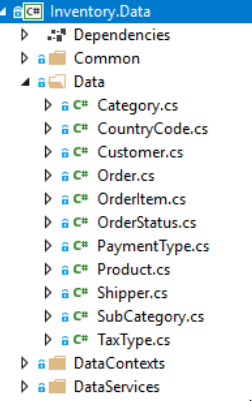
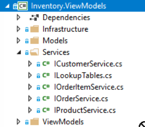

## Data Access

One of the most important parts of the *Inventory Sample app* is how we access to the different Data Sources and how this logic is decoupled from the rest of the app.

We will review in detail the *Inventory.Data* project and how we use it in the application.

### Inventory.Data project

When our *data source* is a relational database, we are using [Entity Framework Core](../dataaccess.md) to manipulate the data and expose it.

Wer can split the project in three principal parts:

#### Data

Inside the *Data* folder are located all the data models, representing each table of the database:



These models will be our *Data Transfer Objects* or *DTOs* of our app.

#### IDataSource 

It represents the *Entity Framework context* or the *database source*. We will have a class implementing `IDataSource` for each *context* representing a database.

```c#
public interface IDataSource : IDisposable
{
    DbSet<CountryCode> CountryCodes { get; }
    DbSet<PaymentType> PaymentTypes { get; }
    DbSet<TaxType> TaxTypes { get; }
    DbSet<OrderStatus> OrderStatus { get; }
    DbSet<Shipper> Shippers { get; }

    DbSet<Customer> Customers { get; }
    DbSet<Order> Orders { get; }
    DbSet<OrderItem> OrderItems { get; }
    DbSet<Product> Products { get; }

    EntityEntry<TEntity> Entry<TEntity>(TEntity entity) where TEntity : class;

    Task<int> SaveChangesAsync(CancellationToken cancellationToken = default(CancellationToken));
}
```
We have two implementations of this interface: `SQLiteDb` and `SQLServerDb`, representing two different databases that will share the same logic to access, manipulate and expose the data.

#### IDataService

This is the contract that is has to be used to access the database of the application.

```c#
public interface IDataService : IDisposable
{
    Task<Customer> GetCustomerAsync(long id);
    Task<IList<Customer>> GetCustomersAsync(int skip, int take, DataRequest<Customer> request);
    Task<IList<Customer>> GetCustomerKeysAsync(int skip, int take, DataRequest<Customer> request);
    Task<int> GetCustomersCountAsync(DataRequest<Customer> request);
    Task<int> UpdateCustomerAsync(Customer customer);
    Task<int> DeleteCustomersAsync(params Customer[] customers);

    Task<Order> GetOrderAsync(long id);
    Task<IList<Order>> GetOrdersAsync(int skip, int take, DataRequest<Order> request);
    Task<IList<Order>> GetOrderKeysAsync(int skip, int take, DataRequest<Order> request);
    Task<int> GetOrdersCountAsync(DataRequest<Order> request);
    Task<int> UpdateOrderAsync(Order order);
    Task<int> DeleteOrdersAsync(params Order[] orders);

    Task<OrderItem> GetOrderItemAsync(long orderID, int orderLine);
    Task<IList<OrderItem>> GetOrderItemsAsync(int skip, int take, DataRequest<OrderItem> request);
    Task<IList<OrderItem>> GetOrderItemKeysAsync(int skip, int take, DataRequest<OrderItem> request);
    Task<int> GetOrderItemsCountAsync(DataRequest<OrderItem> request);
    Task<int> UpdateOrderItemAsync(OrderItem orderItem);
    Task<int> DeleteOrderItemsAsync(params OrderItem[] orderItems);

    Task<Product> GetProductAsync(string id);
    Task<IList<Product>> GetProductsAsync(int skip, int take, DataRequest<Product> request);
    Task<IList<Product>> GetProductKeysAsync(int skip, int take, DataRequest<Product> request);
    Task<int> GetProductsCountAsync(DataRequest<Product> request);
    Task<int> UpdateProductAsync(Product product);
    Task<int> DeleteProductsAsync(params Product[] products);


    Task<IList<Category>> GetCategoriesAsync();
    Task<IList<CountryCode>> GetCountryCodesAsync();
    Task<IList<OrderStatus>> GetOrderStatusAsync();
    Task<IList<PaymentType>> GetPaymentTypesAsync();
    Task<IList<Shipper>> GetShippersAsync();
    Task<IList<TaxType>> GetTaxTypesAsync();
}
```

### Accessing the data from the app 

The way that we are accessing the data is through the following services, one per functionality of the app and we can find them in the *Services* folder inside the *Inventory.ViewModels* project:



Let's have a look a one of them:

```c#
public interface ICustomerService
{
    Task<CustomerModel> GetCustomerAsync(long id);
    Task<IList<CustomerModel>> GetCustomersAsync(DataRequest<Customer> request);
    Task<IList<CustomerModel>> GetCustomersAsync(int skip, int take, DataRequest<Customer> request);
    Task<int> GetCustomersCountAsync(DataRequest<Customer> request);

    Task<int> UpdateCustomerAsync(CustomerModel model);

    Task<int> DeleteCustomerAsync(CustomerModel model);
    Task<int> DeleteCustomerRangeAsync(int index, int length, DataRequest<Customer> request);
}
```

This *contract* is not only accessing the data source, it is also acting as a mapper between our DTOs models and the Models that we used to represent the data visually. 

There are some advantajes in map our DTOs models to *visual models* like:

- Not all the info of the DTO needs to be displayed in our views.
- DTOs should be normally simple classes with no behaviour defined in order to facilitate serialization.

### Data Service Factory

Finally, we just need to review the interface `IDataServiceFactory` which is the one responsable of provide the *Data source* that we use in the app. 

```c#
public interface IDataServiceFactory
{
    IDataService CreateDataService();
}
```

The possible *data providers* that we are offering to be used in the app are: `SQLite`, `SQLServer` and `WebAPI`, and are defined by the following enum class:

```c#
public enum DataProviderType
{
    SQLite,
    SQLServer,
    WebAPI
}
```

To establish the Data Source to use, we just need to set the property `DataProvider` of the `AppSettings` class. By default, we are loading the `SQLite` data provider:

```c#
public DataProviderType DataProvider
{
    get => (DataProviderType)GetSettingsValue("DataProvider", (int)DataProviderType.SQLite);
    set => LocalSettings.Values["DataProvider"] = (int)value;
}
```
